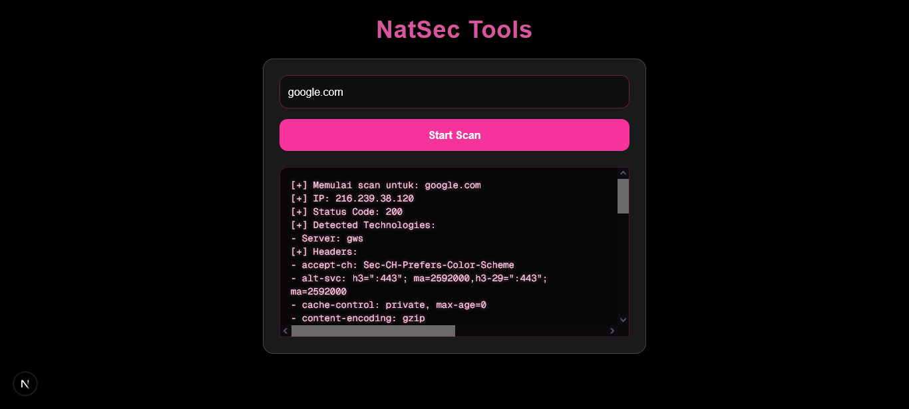

# WebReckonbynat

> Web interaktif untuk scanning website, dibuat oleh Natasyha (NatNatt-Dev).

## 🔹 Deskripsi
WebReckon adalah aplikasi berbasis **Next.js** yang memungkinkan pengguna melakukan scanning website secara cepat.  
Fitur utama termasuk pengecekan IP, deteksi teknologi dari header, dan scan subdomain.  


## 🔹 Preview



## 🔹 Fitur
- Scan website target
- Resolve IP dari hostname
- Deteksi teknologi berdasarkan header HTTP
- Scan subdomain umum
- Modern UI dengan Next.js 13 + TypeScript

## 🔹 Cara Install
```bash
git clone https://github.com/NatNatt-Dev/WebReckonbynat.git
cd webreckon
npm install
npm run dev
